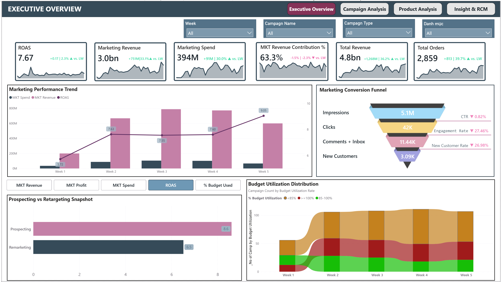
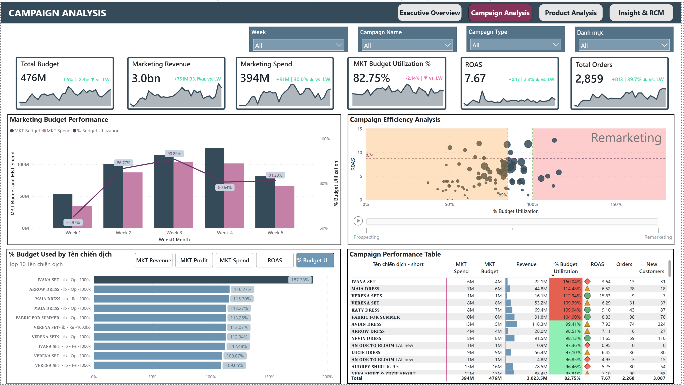
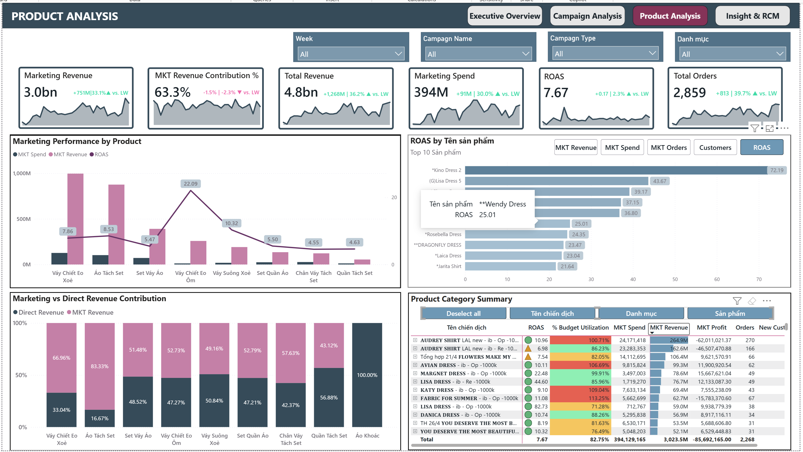
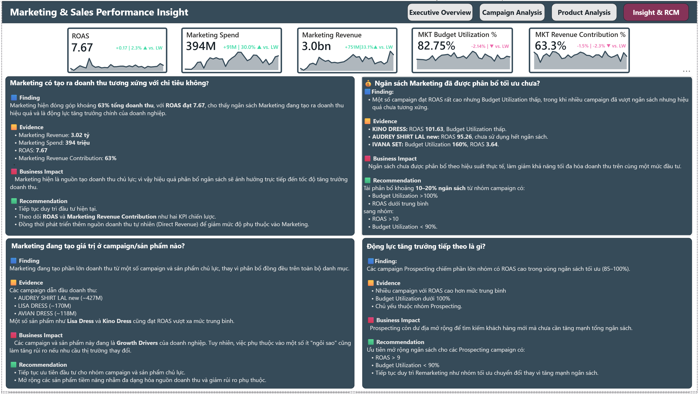
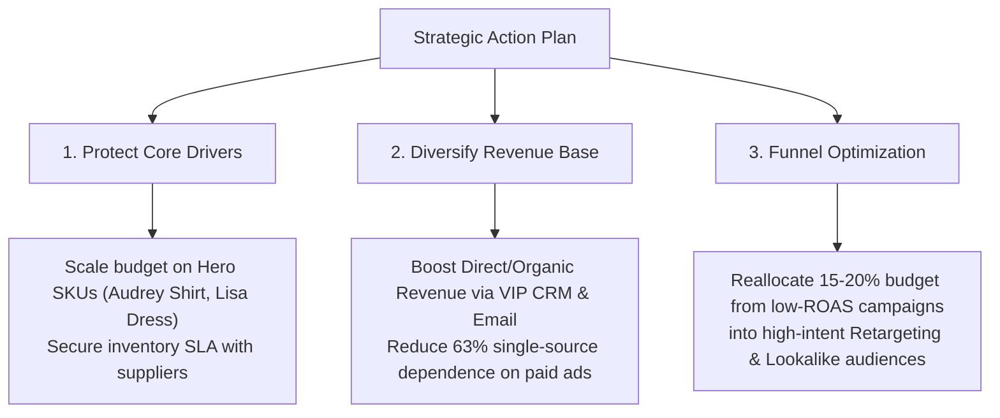
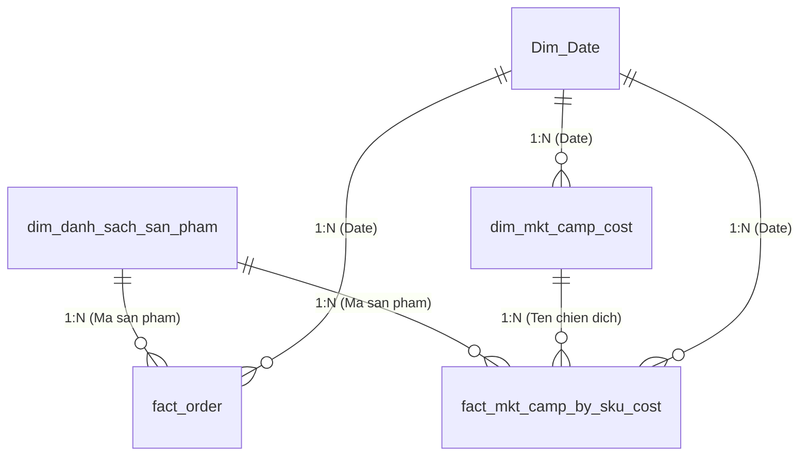

# 🛍️ Fashion Retail Marketing ROI & Sales Performance Analytics

[](https://powerbi.microsoft.com/)
[](https://learn.microsoft.com/en-us/dax/)
[](https://learn.microsoft.com/en-us/power-bi/guidance/star-schema)
[]()

> **An end-to-end tactical business intelligence dashboard built to align retail sales performance with digital marketing expenditure, optimize Return on Ad Spend (ROAS), and empower executive decision-making.**

---

## 📌 Table of Contents
1. [Executive Summary](#-executive-summary)
2. [Business Problem & Objectives](#-business-problem--objectives)
3. [Interactive Dashboard Live Demo](#-interactive-dashboard-live-demo)
4. [Dashboard Walkthrough & Visuals](#-dashboard-walkthrough--visuals)
5. [Key Business Insights & Evidence](#-key-business-insights--evidence)
6. [Strategic Recommendations](#-strategic-recommendations)
7. [Data Architecture & Modeling](#-data-architecture--modeling)
8. [Advanced DAX Calculations](#-advanced-dax-calculations)
9. [Repository Structure](#-repository-structure)
10. [How to Reproduce & Open the Project](#-how-to-reproduce--open-the-project)
11. [Author & Contact](#-author--contact)

---

## 🏢 Executive Summary

In contemporary fashion e-commerce, digital advertising is often the primary growth engine. However, businesses frequently encounter a major blind spot: **marketing spend and transaction revenue reside in siloed systems**. This disconnect leaves marketing leaders unable to determine which specific campaigns, channels, or SKUs truly drive profitable returns.

This project delivers a **tactical Business Intelligence solution** designed for the **Senior Marketing Manager** and **Sales Director**. By ingesting multi-table transactional records and digital ad campaign metrics across May 2024 (2,858 orders, 3,451 order lines, and 850+ campaign daily records), this dashboard establishes full-funnel attribution from **Impression $\rightarrow$ Click $\rightarrow$ Message $\rightarrow$ Conversion**.

### 🌟 Key Headline Results:
* **Total Revenue:** **4.77 Billion VND** across 2,858 successful orders.
* **Marketing Revenue:** **3.02 Billion VND**, representing **63.3%** of total business turnover.
* **Total Marketing Spend:** **394 Million VND** with an overall **Blended ROAS of 7.67x**.
* **Concentration Risk:** Over **70% of ad revenue** is generated by a handful of "Hero Campaigns" (*Audrey Shirt, Lisa Dress, Avian Dress*).

---

## 🎯 Business Problem & Objectives

### 1. Pain Points (Stakeholder Empathy)
* **Budget Dispersion:** Ad budget is fragmented across hundreds of campaigns with no unified measure of effectiveness.
* **Attribution Disconnect:** Marketing costs and sales receipts are tracked in isolation, making it difficult to prove marketing ROI to the Executive Board.
* **SKU Complexity:** Over 300+ apparel SKUs make it challenging to identify which products justify high promotional spend vs. which should rely on organic demand.

### 2. Core Business Questions Answered
1. *How effectively is the marketing budget being utilized across weeks and campaign types?*
2. *Is digital marketing driving revenue proportionally to ad spend (ROAS)?*
3. *Which specific campaigns and fashion SKUs are the genuine growth drivers?*
4. *How can budget re-allocation maximize total gross revenue while mitigating single-product dependency?*

---

## 🌐 Interactive Dashboard Live Demo

🔗 **[Click Here to Explore the Interactive Dashboard on NovyPro](https://www.novypro.com/)** *(Live Demo Link)*  
*(Note: If viewing on mobile or desktop without Power BI installed, you can interact with the live report, slice by week, filter campaign types, and hover for tooltips via the link above).*

---

## 📊 Dashboard Walkthrough & Visuals

The report is structured into **4 Analytical Pages** and **3 Specialized Report-Page Tooltips**, adhering to user-centric Design Thinking principles:

### 1. Page 1: Executive Overview
* **Purpose:** High-level strategic pulse check for senior leadership.
* **Core Elements:**
  * **Top Scorecards (with WoW Time Intelligence):** Total Revenue, Marketing Revenue Contribution %, Marketing Spend, % Budget Utilization, and Blended ROAS.
  * **Marketing Performance Trend:** Weekly progression of spend vs. attributed revenue.
  * **Prospecting vs. Retargeting Snapshot:** Breakdown of top-of-funnel customer acquisition vs. mid/bottom-funnel remarketing.
  * **Budget Utilization Distribution:** Gauge of spend pacing against allocated monthly caps.

*(Insert screenshot: `assets/dashboards/01_Executive_Overview.png`)*


---

### 2. Page 2: Campaign Analysis
* **Purpose:** Tactical evaluation of marketing campaigns for performance marketers and media buyers.
* **Core Elements:**
  * **Campaign Efficiency Matrix:** Scatter bubble visual analyzing Spend vs. ROAS to identify over-funded underperformers and under-funded high-converters.
  * **Marketing Budget Performance:** Comparison of allocated budget vs. actual spend.
  * **Detailed Campaign Performance Table:** Granular metrics including Impressions, Clicks, CTR, CPC, Inboxes/Comments, and Attributed Orders.

*(Insert screenshot: `assets/dashboards/02_Campaign_Analysis.png`)*


---

### 3. Page 3: Product Analysis
* **Purpose:** Merchandising and inventory alignment with marketing efforts.
* **Core Elements:**
  * **Product Category Performance:** Revenue contribution across Dresses, Shirts, Pants, and Accessories.
  * **Hero SKU Leaderboard:** Ranking of top revenue-driving products and their respective ROAS.
  * **Marketing vs. Direct Revenue Contribution:** Visualizing the organic vs. paid split per category to evaluate brand equity.

*(Insert screenshot: `assets/dashboards/03_Product_Analysis.png`)*


---

### 4. Page 4: Strategic Insights & Recommendations
* **Purpose:** Translating analytical findings into concrete executive actions using the **Finding $\rightarrow$ Evidence $\rightarrow$ Business Impact $\rightarrow$ Recommendation** framework.

*(Insert screenshot: `assets/dashboards/04_Insight_Recommendations.png`)*


---

### 5. Interactive Tooltips (Micro-Interactions)
* **`Tooltip_Campaign_type`**: Displays conversion funnel metrics upon hovering over campaign categories.
* **`Tooltip_product_detail`**: Reveals SKU images, category metadata, and unit economics on hover.
* **`Tooltip_Campaign_detail`**: Breaks down daily spend trajectory for any selected campaign.

---

## 💡 Key Business Insights & Evidence

### 🔍 Insight 1: Marketing is the Primary Revenue Driver with High Capital Efficiency
* **Evidence:** 
  * Marketing-attributed revenue reached **3.02 Billion VND**, contributing **63.3%** of total business turnover.
  * Total ad spend of **394 Million VND** yielded a remarkable **ROAS of 7.67x**.
* **Business Impact:** Digital marketing is not a cost center; it is the dominant engine of business viability and expansion.

### 🔍 Insight 2: Severe Revenue Concentration in a Small Basket of "Hero Products"
* **Evidence:**
  * Top revenue-generating campaigns:
    * `AUDREY SHIRT LAL new`: **~427 Million VND**
    * `LISA DRESS`: **~170 Million VND**
    * `AVIAN DRESS`: **~118 Million VND**
  * Specific SKUs like **Lisa Dress** and **Kino Dress** delivered ROAS levels significantly exceeding the corporate baseline.
* **Business Impact:** High commercial dependency on a few top performers creates substantial revenue vulnerability if customer trends shift or supply-chain stockouts occur.

### 🔍 Insight 3: Disparity in Retargeting vs. Prospecting ROI
* **Evidence:** Prospecting campaigns consumed the majority of the budget but exhibited variable conversion rates. Retargeting campaigns achieved significantly higher conversion efficiency and lower Cost Per Acquisition (CPA).
* **Business Impact:** Suboptimal budget balance between customer acquisition and customer retention.

---

## 🚀 Strategic Recommendations



| Priority | Initiative | Action Details | Expected Impact |
| :---: | :--- | :--- | :--- |
| **P1 - Immediate** | **Scale Budget on High-ROAS Hero SKUs** | Increase daily budget caps by 15–20% on `AUDREY SHIRT` and `LISA DRESS` while monitoring marginal ROAS. | Capture additional revenue while maintaining ROAS > 6.5x. |
| **P2 - Short Term** | **Cut Off Low-Efficiency Campaigns** | Pause or restructure ad sets where ROAS falls below the 3.0x break-even threshold. | Reallocate ~40M VND/month into proven creative angles. |
| **P3 - Medium Term** | **Build Direct & Organic Retention Channels** | Implement automated post-purchase CRM flows (loyalty points, re-engagement offers). | Elevate Direct Revenue share from 36.7% to 45%+, insulating margins. |

---

## 🏗️ Data Architecture & Modeling

The data model is engineered according to dimensional modeling best practices (**Star Schema**), optimizing query performance and DAX efficiency.



### Table Dictionary Summary:
* **`fact_order`:** 3,451 transactional rows capturing individual line items, customer segments, gross sale price, discounts, and order fulfillment status.
* **`fact_mkt_camp_by_sku_cost`:** Granular attribution table tracking marketing costs and customer responses (comments, inboxes) per SKU.
* **`dim_mkt_camp_cost`:** Daily aggregate marketing metrics including Impressions, Clicks, CPC, CPM, and Budgets.
* **`dim_danh_sach_san_pham`:** Product master data holding category taxonomy, retail prices, and unit costs.
* **`Dim_Date`:** Standardized analytical date dimension enabling Week-over-Week (WoW) calculations.

---

## 🧮 Advanced DAX Calculations

Below are samples of the enterprise-grade DAX measures implemented in the report:

### 1. Return on Ad Spend (ROAS)
```dax
ROAS = 
DIVIDE(
    [MKT Revenue by Camp],
    [MKT Spend],
    0
)
```

### 2. Marketing Revenue Contribution Percentage
```dax
MKT Revenue Contribution % = 
DIVIDE(
    [MKT Revenue by Camp],
    [Total Revenue],
    0
)
```

### 3. Budget Utilization Rate
```dax
% Budget Utilization = 
DIVIDE(
    [MKT Spend],
    [MKT Budget],
    0
)
```

### 4. Dynamic Time Intelligence: Week-over-Week (WoW) Spend Variance
```dax
MKT Spend vs LW % = 
VAR _CurrentSpend = [MKT Spend]
VAR _LastWeekSpend = 
    CALCULATE(
        [MKT Spend],
        DATEADD('Dim_Date'[Date], -7, DAY)
    )
RETURN
    DIVIDE(_CurrentSpend - _LastWeekSpend, _LastWeekSpend, 0)
```

### 5. Dynamic KPI Card Formatted Label (UX Enhancement)
```dax
MTK ROAS Label WoW = 
VAR _VarPct = [MKT ROAS vs LW %]
RETURN
    IF(
        ISBLANK(_VarPct),
        "- vs LW",
        IF(
            _VarPct >= 0,
            "▲ +" & FORMAT(_VarPct, "0.0%") & " vs LW",
            "▼ " & FORMAT(_VarPct, "0.0%") & " vs LW"
        )
    )
```

---

## 📁 Repository Structure

```
powerbi-fashion-retail-marketing-analytics/
├── assets/
│   ├── dashboards/               # High-resolution screenshots of each dashboard page
│   │   ├── 01_Executive_Overview.png
│   │   ├── 02_Campaign_Analysis.png
│   │   ├── 03_Product_Analysis.png
│   │   └── 04_Insight_Recommendations.png
│   └── model/                    # Star Schema diagram screenshots
├── data/
│   ├── data_dictionary.md        # Comprehensive metadata and data dictionary
│   └── Fashion_Analyst_Dataset.xlsx # Sanitized source dataset
├── docs/
│   └── design_thinking_framework.md # 5W1H, Empathy map, and POV Growth Formula
├── pbix/
│   └── Fashion_Retail_Marketing_Performance_Analytics.pbix # Official Final Power BI report
├── .gitignore                    # Excludes backups, temp files, and caches
└── README.md                     # Executive portfolio documentation
```

---

## 💻 How to Reproduce & Open the Project

1. **Clone this repository:**
   ```bash
   git clone https://github.com/thunx280-ctrl/powerbi-fashion-retail-marketing-analytics.git
   ```
2. **Open the report:**
   * Double-click `pbix/Fashion_Retail_Marketing_Performance_Analytics.pbix` (Requires [Power BI Desktop](https://powerbi.microsoft.com/desktop/) version 2024 or later).
3. **Data Source Settings (if needed):**
   * If prompting for dataset path, go to **Home $\rightarrow$ Transform Data $\rightarrow$ Data source settings**, and point to `data/Fashion_Analyst_Dataset.xlsx`.

---

## 👤 Author & Contact

* **Author:** **Nguyễn Xuân Thu**
* **Role:** Data Analyst (Specializing in Business Intelligence, E-Commerce & Growth Analytics)
* **Email:** *[thu.nx280@gmail.com]*
* **LinkedIn:** *[https://linkedin.com/]*
* **GitHub:** *[https://github.com/thunx280-ctrl]*

---
*⭐ If you find this project insightful for your business or hiring review, please star the repository!*
