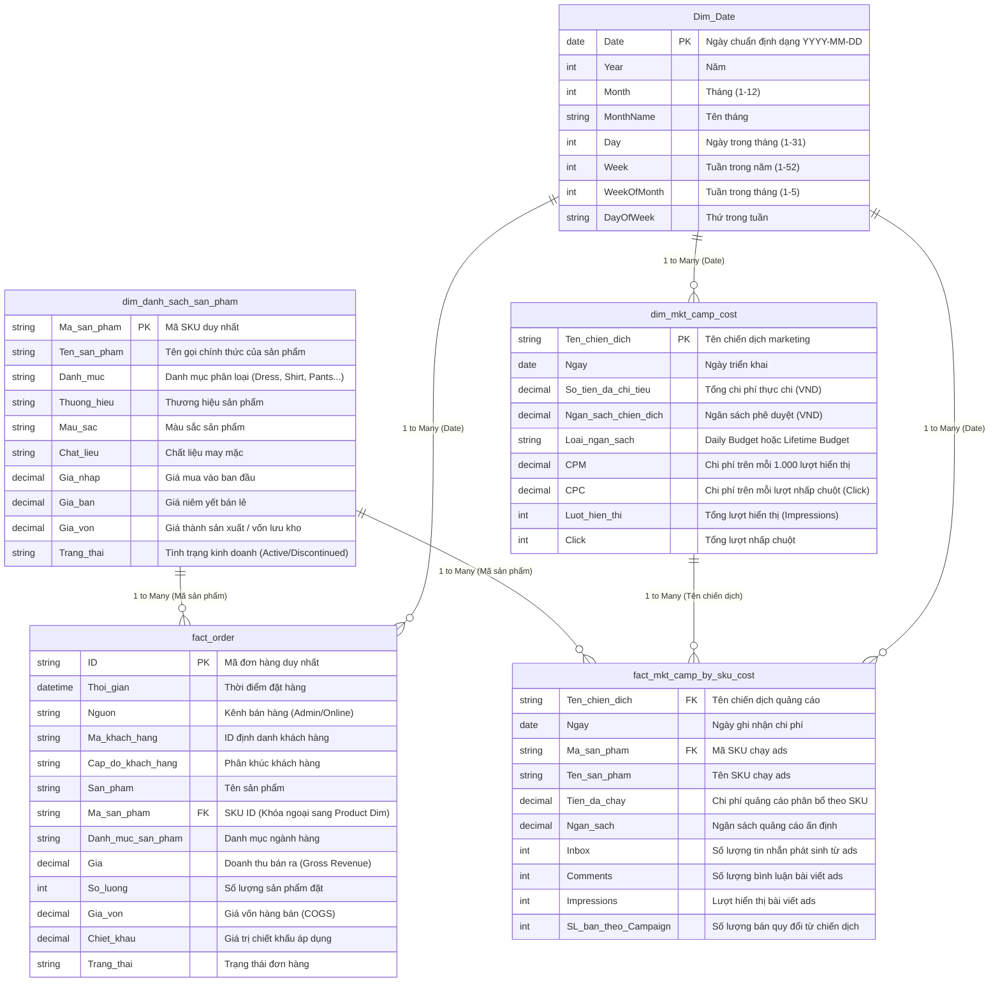

# 📖 Data Dictionary - Fashion Retail Analytics

This document describes the schema, table relationships, and field definitions utilized in the **Fashion Retail Marketing & Sales Performance Analytics** dashboard.

---

## 🏗️ Data Architecture Overview

The data model follows an analytical schema with **2 Fact Tables** and **3 Dimension Tables**, linked via 1-to-Many relationships.

---

## 📋 Chi tiết các bảng dữ liệu

### 1. `fact_order` (Bảng giao dịch đơn hàng)
* **Grain (Độ hạt):** 1 dòng = 1 SKU trong đơn hàng được tạo.
* **Thời gian ghi nhận:** 01/05/2024 – 31/05/2024.
* **Quy mô:** 3,451 dòng giao dịch, 2,858 đơn hàng thành công.
* **Mục đích:** Tính toán tổng doanh thu toàn doanh nghiệp (`Total Revenue`), số lượng đơn hàng (`Total Orders`), giá trị trung bình đơn hàng (`AOV`), và đối chiếu với doanh thu tạo ra từ quảng cáo.

### 2. `fact_mkt_camp_by_sku_cost` (Bảng chi phí marketing phân bổ theo SKU)
* **Grain:** 1 dòng = 1 SKU được chạy quảng cáo trong 1 chiến dịch theo từng ngày.
* **Mục đích:** Cung cấp độ sâu phân tích ở cấp độ sản phẩm (SKU-level attribution), giúp đánh giá sản phẩm nào chạy ads hiệu quả nhất.

### 3. `dim_mkt_camp_cost` (Bảng tổng hợp chi phí chiến dịch)
* **Grain:** 1 dòng = 1 chiến dịch marketing theo ngày.
* **Mục đích:** Theo dõi ngân sách (`MKT Budget`), chi phí thực tế (`MKT Spend`), tỷ lệ sử dụng ngân sách (`% Budget Utilization`), và các chỉ số phễu marketing (`CPM`, `CPC`, `CTR`, `Impressions`, `Clicks`).

### 4. `dim_danh_sach_san_pham` (Danh mục sản phẩm)
* **Grain:** 1 dòng = 1 SKU định danh.
* **Mục đích:** Phân tích hiệu suất theo danh mục (`Category`), phân loại sản phẩm chủ lực (Hero Products) vs sản phẩm thứ cấp.

### 5. `Dim_Date` (Bảng thời gian chuẩn)
* **Mục đích:** Hỗ trợ tính toán Time Intelligence (so sánh theo tuần WoW, theo tháng MoM) và đồng bộ trục thời gian giữa doanh số bán lẻ và chi tiêu marketing.
