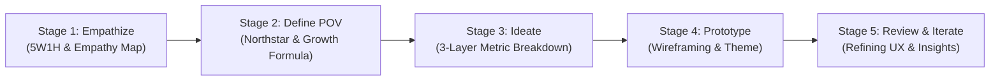

# 🧠 Design Thinking Framework: Fashion Retail Marketing Optimization

This document outlines the **User-Centric Design Thinking Process** applied in developing the **Fashion Retail Marketing & Sales Performance Dashboard**.

---

---

## 🎯 Stage 1: Empathize (Thấu cảm người dùng)

### 1. Phân tích 5W1H
* **Who (Đối tượng sử dụng chính):** **Senior Marketing Manager** & **Sales Director**.
* **What (Vấn đề cần giải quyết):** 
  * Chi tiêu ngân sách marketing phân tán qua hàng chục chiến dịch nhưng không rõ chiến dịch nào thực sự tạo ra doanh thu.
  * Thiếu liên kết giữa chi phí quảng cáo (Ad Spend) và doanh thu thực tế (Sales Revenue).
  * Khó nhận diện danh mục sản phẩm/SKU chủ lực để tối ưu phân bổ ngân sách.
* **When & Where:** Được sử dụng định kỳ hàng tuần (Weekly Performance Review) và hàng tháng (Monthly Budget Allocation Meeting).
* **Why:** Nhằm cắt giảm lãng phí ngân sách quảng cáo, tối đa hóa tỷ suất sinh lời trên chi phí quảng cáo (**ROAS**), và gia tăng doanh thu tổng thể.
* **How:** Cung cấp báo cáo trực quan cho phép so sánh hiệu suất theo thời gian, theo dõi phễu chuyển đổi từ Click $\rightarrow$ Message $\rightarrow$ Order, và phân loại hiệu suất sản phẩm.

### 2. Empathy Map (Bản đồ thấu cảm)
* **Suy nghĩ & Cảm xúc (Thinking & Feeling):** 
  * *"Ngân sách quảng cáo có đang bị lãng phí ở những chiến dịch kém hiệu quả không?"*
  * *"Nếu tăng gấp đôi ngân sách cho chiến dịch này, doanh thu có tăng tương ứng không?"*
  * *Áp lực liên tục về việc chứng minh ROI của phòng Marketing trước CEO và Hội đồng quản trị.*
* **Hành động & Lời nói (Saying & Doing):**
  * Hàng tuần phải tổng hợp dữ liệu thủ công từ nhiều nguồn rời rạc (Báo cáo Ads Facebook/Tiktok vs Hệ thống POS/ERP).
  * Quyết định tăng/giảm ngân sách chủ yếu dựa trên cảm tính thay vì số liệu quy đổi doanh thu chính xác.
* **Nỗi đau (Pains):**
  * Dữ liệu bán hàng và chi phí Marketing tách rời trên hai hệ thống riêng biệt.
  * Hơn 300+ SKU khiến việc theo dõi hiệu suất từng sản phẩm gặp quá tải thông tin.
* **Lợi ích mong đợi (Gains):**
  * Nắm được chỉ số **ROAS** chuẩn xác theo từng chiến dịch và từng SKU.
  * Dashboard tập trung, cập nhật nhanh chóng với các lát cắt linh hoạt (Filter theo tuần, loại chiến dịch, danh mục sản phẩm).

---

## 🧭 Stage 2: Define Point of View (Xác định góc nhìn & Northstar)

### 1. Xác định Northstar Metrics (Chỉ số Bắc Đẩu)
* **Northstar 1 (Quy mô giá trị):** **Marketing Revenue** (Doanh thu đóng góp từ kênh Marketing)
  * *Tại sao chọn:* Đây là thước đo trực tiếp nhất về đóng góp thương mại của Marketing đối với toàn công ty.
* **Northstar 2 (Hiệu suất tài chính):** **ROAS (Return on Ad Spend)**
  * *Công thức:* $\text{ROAS} = \frac{\text{Marketing Revenue}}{\text{Marketing Spend}}$
  * *Tại sao chọn:* Đảm bảo quy mô doanh thu không được đánh đổi bằng việc "đốt tiền" vô tội vạ.

### 2. Công thức tăng trưởng (Growth Formula)
$$\text{Total Revenue} = \text{Marketing Revenue} + \text{Direct Revenue}$$
$$\text{Marketing Revenue} = \text{MKT Spend} \times \text{ROAS} = (\text{Impressions} \times \text{CTR} \times \text{CPC}) \times \text{Conversion Rate} \times \text{AOV}$$

---

## 💡 Stage 3: Ideate (Ý tưởng cấu trúc báo cáo)

Báo cáo được tổ chức theo mô hình **3 Tầng thông tin (3-Layer Information Architecture)** để phục vụ từ Lãnh đạo cấp cao đến Chuyên viên thực thi:

* **Layer 0 (Executive Scorecards):** Các thẻ KPI cốt lõi ở đầu trang, thể hiện số liệu tuần hiện tại kèm mức tăng trưởng so với tuần trước (WoW):
  * `Total Revenue` & `MKT Revenue Contribution %`
  * `MKT Spend` & `% Budget Utilization`
  * `ROAS` & `Total Orders`
* **Layer 1 (Performance Breakdown by 1 Dimension):**
  * Xu hướng doanh thu và chi phí theo thời gian (Trend over Time).
  * Phân bổ ngân sách theo loại chiến dịch (Prospecting vs Retargeting).
  * Xếp hạng chiến dịch theo ROAS.
* **Layer 2 (Deep-dive Multi-dimensional Exploration):**
  * Hiệu suất theo danh mục và từng mã SKU chi tiết.
  * Ma trận phân tán (Scatter Bubble Chart): Chi phí vs ROAS để tìm ra các "ngôi sao tiềm năng" (Hidden Gems) và "hố đen tiêu tiền" (Money Pits).

---

## 🎨 Stage 4 & 5: Prototype & Iterative Review

* **Version 1 (Bản thảo sơ khởi):** Tập trung vào việc liên kết bảng dữ liệu và hiển thị các biểu đồ cơ bản. Gặp nhược điểm về màu sắc chưa đồng nhất và thiếu ngữ cảnh so sánh theo tuần.
* **Version 2 (Tối ưu hóa UI/UX):** Bổ sung bảng màu Accessible Orchid chuyên nghiệp, đưa các chỉ số WoW vào Scorecard.
* **Version 3 (Bản hoàn thiện cao cấp - Final):**
  * Tích hợp **Field Parameters** cho phép người dùng linh hoạt hoán đổi góc nhìn (Top N, chọn Dimension sản phẩm).
  * Xây dựng **Report Page Tooltips** giúp xem nhanh chi tiết chiến dịch và thông tin sản phẩm mà không làm rối màn hình chính.
  * Bổ sung trang **Insight & Recommendations** đúc kết các phát hiện chiến lược theo mô hình **Finding $\rightarrow$ Evidence $\rightarrow$ Business Impact $\rightarrow$ Actionable Recommendations**.
